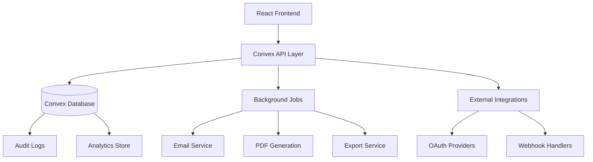

# Design Document

## Overview

This design document outlines the architecture for enhancing the existing platform across six functional areas: workflows/orchestration, marketing suite, analytics/reporting, compliance/QMS, integrations/security, and onboarding/knowledge management. The enhancement builds upon the existing Convex-based architecture with React frontend, extending current capabilities while maintaining backward compatibility.

The design follows a modular approach with feature flags for controlled rollout, leveraging existing authentication, role-based permissions, and audit logging infrastructure. Each functional area is designed as a self-contained module that can be developed and deployed independently.

## Architecture

### System Architecture

The platform follows a modern full-stack architecture:

- **Frontend**: React with TypeScript, using existing UI components (shadcn/ui)
- **Backend**: Convex serverless functions with real-time subscriptions
- **Database**: Convex document database with existing schema extensions
- **Authentication**: Existing auth system with role-based permissions
- **Background Jobs**: Convex scheduled functions for exports, reports, and notifications
- **Feature Management**: Feature flags for controlled rollout

### Data Flow Architecture

### Security Architecture

- **Authentication**: Existing user authentication system
- **Authorization**: Role-based access control (RBAC) with business-level permissions
- **Audit Trail**: All state changes logged to existing audit system
- **Data Encryption**: OAuth tokens encrypted at rest
- **Rate Limiting**: API rate limiting and notification throttling

## Components and Interfaces

### 1. Workflow Orchestration Enhancement

#### Step Assignment System
- **StepAssignmentManager**: Handles user assignment and due date management
- **ApprovalQueue**: Manages pending approvals with SLA tracking
- **NotificationService**: Sends assignment and due date notifications

#### Template Gallery Enhancement
- **TemplateFilter**: Advanced filtering by industry, tier, and search
- **TemplateRecommendation**: AI-powered template suggestions

### 2. Marketing Suite

#### Email Designer
- **BlockEditor**: Drag-and-drop email builder with pre-built blocks
- **EmailScheduler**: Campaign scheduling with timezone support
- **TestSendService**: Preview and test email functionality
- **UnsubscribeManager**: Automatic unsubscribe token handling

#### SEO Suggestion Widget
- **SEOAnalyzer**: Real-time content analysis for SEO optimization
- **SuggestionEngine**: Provides title, meta, H1, and readability suggestions
- **PerformanceOptimizer**: <300ms response time optimization

### 3. Analytics and Reporting Platform

#### Dashboard Creator
- **CardLibrary**: Pre-built visualization components (KPI, time series, funnel, bar)
- **DashboardBuilder**: Drag-and-drop dashboard creation
- **DataConnector**: Connects to existing analytics store

#### Export System
- **ExportService**: CSV/PDF generation with queue-based processing
- **ScheduledReports**: Automated report generation and email delivery
- **PerformanceOptimizer**: <2 minute p95 export completion

### 4. Compliance and Quality Management System

#### CAPA Status Board
- **KanbanView**: Visual CAPA workflow management
- **SLATimer**: Automatic SLA tracking and breach notifications
- **VerificationStep**: Required verification before CAPA closure

#### Risk Register
- **RiskManager**: Risk creation, assessment, and tracking
- **SeverityScoring**: Automated risk severity calculation
- **ExportCapability**: Risk register export functionality

### 5. Integrations and Security Hub

#### OAuth Integration Manager
- **OAuthConnector**: Secure OAuth 2.0 connection handling
- **TokenManager**: Encrypted token storage and refresh
- **HealthMonitor**: Integration health checks and status monitoring

#### SSO Placeholder System
- **SSOInterface**: Placeholder UI for future enterprise SSO
- **ConfigurationManager**: SSO configuration management interface

### 6. Onboarding and Knowledge Management

#### Enhanced Onboarding Wizard
- **OnboardingOrchestrator**: Multi-step wizard with progress tracking
- **TemplateRecommendation**: Industry-specific template suggestions
- **IntegrationSetup**: Guided integration connection process
- **ProgressTracker**: Resumable onboarding with completion tracking

#### Contextual Tips System
- **TipEngine**: Context-aware help and guidance
- **ProgressiveDisclosure**: Feature introduction based on user journey
- **HelpOverlay**: Interactive feature tours

## Error Handling

### Error Classification
- **User Errors**: Invalid input, permission denied, resource not found
- **System Errors**: Database failures, external service timeouts
- **Integration Errors**: OAuth failures, webhook delivery failures
- **Performance Errors**: Export timeouts, query performance issues

### Error Recovery Strategies
- **Retry Logic**: Exponential backoff for transient failures
- **Circuit Breaker**: Prevent cascade failures in external integrations
- **Graceful Degradation**: Fallback functionality when services are unavailable
- **User Feedback**: Clear error messages with actionable guidance

## Testing Strategy

### Unit Testing
- **Component Tests**: React component testing with Jest and React Testing Library
- **Function Tests**: Convex function testing with mocked dependencies
- **Utility Tests**: Pure function testing for business logic

### Integration Testing
- **API Tests**: End-to-end API testing with real database
- **Workflow Tests**: Complete workflow execution testing
- **OAuth Tests**: Integration testing with OAuth providers (mocked)

### Performance Testing
- **Load Testing**: Export system performance under load
- **Stress Testing**: System behavior under high concurrent usage
- **Benchmark Testing**: Response time benchmarks for critical paths

### Security Testing
- **Permission Tests**: Role-based access control validation
- **Input Validation**: SQL injection and XSS prevention
- **Token Security**: OAuth token encryption and handling

## Performance Considerations

### Frontend Optimization
- **Code Splitting**: Lazy loading of feature modules
- **Caching**: Aggressive caching of static assets and API responses
- **Bundle Optimization**: Tree shaking and minification

### Backend Optimization
- **Query Optimization**: Efficient database queries with proper indexing
- **Caching Layer**: Redis caching for frequently accessed data
- **Background Processing**: Queue-based processing for heavy operations

### Database Optimization
- **Index Strategy**: Optimized indexes for query patterns
- **Data Partitioning**: Partition large tables by business or date
- **Query Performance**: Monitor and optimize slow queries

### Export Performance
- **Streaming**: Stream large exports to avoid memory issues
- **Compression**: Compress export files to reduce transfer time
- **Parallel Processing**: Parallel processing for large datasets