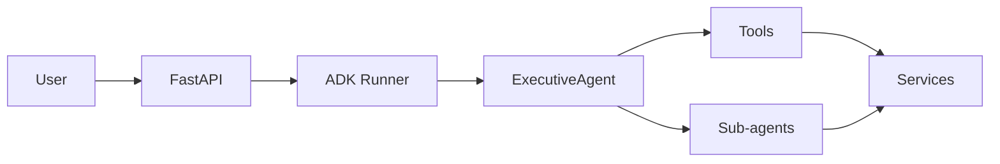

# pikar-ai

ReAct agent with A2A protocol [experimental]
Agent generated with [`googleCloudPlatform/agent-starter-pack`](https://github.com/GoogleCloudPlatform/agent-starter-pack) version `0.31.5`

## Project Structure

```
pikar-ai/
├── app/         # Core agent code
│   ├── agent.py               # Main agent logic
│   ├── fast_api_app.py        # FastAPI Backend server
│   └── app_utils/             # App utilities and helpers
├── .cloudbuild/               # CI/CD pipeline configurations for Google Cloud Build
├── deployment/                # Infrastructure and deployment scripts
├── notebooks/                 # Jupyter notebooks for prototyping and evaluation
├── tests/                     # Unit, integration, and load tests
├── GEMINI.md                  # AI-assisted development guide
├── Makefile                   # Development commands
└── pyproject.toml             # Project dependencies
```

### Architecture

- **Agent:** [app/agent.py](app/agent.py) defines the Executive Agent and ADK `App`. Instructions live in [app/prompts/executive_instruction.txt](app/prompts/executive_instruction.txt). Sub-agents are re-exported from [app/agents/specialized_agents.py](app/agents/specialized_agents.py) and implemented in per-domain modules under `app/agents/`.
- **Tools:** Executive tools are registered in `app/agent.py` and implemented in `app/agents/tools/` (media, calendar, docs, Gmail, etc.). MCP integrations live in `app/mcp/tools/`.
- **Services:** Business logic and external APIs (Vertex, Remotion, Director, Supabase, Redis) live in `app/services/` and `app/rag/`.
- **API:** The FastAPI app is [app/fast_api_app.py](app/fast_api_app.py). A2A routes are under `/a2a/`. Custom chat streaming is at `POST /a2a/app/run_sse`. Feature routers are under `app/routers/`.



## Requirements

Before you begin, ensure you have:
- **uv**: Python package manager (used for all dependency management in this project) - [Install](https://docs.astral.sh/uv/getting-started/installation/) ([add packages](https://docs.astral.sh/uv/concepts/dependencies/) with `uv add <package>`)
- **Google Cloud SDK**: For GCP services - [Install](https://cloud.google.com/sdk/docs/install)
- **Terraform**: For infrastructure deployment - [Install](https://developer.hashicorp.com/terraform/downloads)
- **make**: Build automation tool - [Install](https://www.gnu.org/software/make/) (pre-installed on most Unix-based systems)


## Quick Start

Install required packages and launch the local development environment:

```bash
make install && make playground
```
> **📊 Observability Note:** Agent telemetry (Cloud Trace) is always enabled. Prompt-response logging (GCS, BigQuery, Cloud Logging) is **disabled** locally, **enabled by default** in deployed environments (metadata only - no prompts/responses). See [Monitoring and Observability](#monitoring-and-observability) for details.

## Commands

| Command              | Description                                                                                 |
| -------------------- | ------------------------------------------------------------------------------------------- |
| `make install`       | Install dependencies using uv                                                               |
| `make playground`    | Launch local development environment                                                        |
| `make lint`          | Run code quality checks                                                                     |
| `make test`          | Run unit and integration tests                                                              |
| `make deploy`        | Deploy agent to Cloud Run                                                                   |
| `make local-backend` | Launch local development server with hot-reload                                             |
| `make inspector`     | Launch A2A Protocol Inspector                                                               |
| `make setup-dev-env` | Set up development### Caching Layer
The application uses **Redis** (Google Cloud Memorystore) for caching to reduce database load and improve latency.
- **User Configuration**: Cached for 1 hour.
- **Session Metadata**: Cached for 30 minutes.
- **Personas**: Cached for 2 hours.

The cache implementation follows the **Cache-Aside** pattern. If Redis is unavailable, the application gracefully degrades to direct database queries.

#### Redis Configuration
| Variable | Description | Default |
|----------|-------------|---------|
| `REDIS_HOST` | Redis hostname | `localhost` |
| `REDIS_PORT` | Redis port | `6379` |
| `REDIS_DB` | Redis database index | `0` |
| `REDIS_MAX_CONNECTIONS` | Connection pool size | `20` |

### Video generation

Video creation uses **Vertex AI Veo** for short clips and optional **server-side Remotion** for longer videos.

- **Short clips (Veo):** Requires `GOOGLE_CLOUD_PROJECT` and Vertex AI with Veo enabled. Set credentials via `GOOGLE_APPLICATION_CREDENTIALS` (or `VERTEX_CREDENTIALS_PATH`).
- **Longer videos (Remotion):** Set `REMOTION_RENDER_ENABLED=1` and ensure the `remotion-render` package exists at `REMOTION_RENDER_DIR` (default: repo root `remotion-render`). The directory should contain `package.json` or `src/index.tsx`.

To verify configuration, call **`GET /health/video`**. The response reports `veo_configured` and `remotion_configured` and details (no API calls are made).

### Environment variables / Terraform

For full command options and usage, refer to the [Makefile](Makefile).

## Using the A2A Inspector

This agent implements the [Agent2Agent (A2A) Protocol](https://a2a-protocol.org/), enabling interoperability with agents across different frameworks and languages.

The [A2A Inspector](https://github.com/a2aproject/a2a-inspector) provides the following core features:
- 🔍 View agent card and capabilities
- ✅ Validate A2A specification compliance
- 💬 Test communication with live chat interface
- 🐛 Debug with the raw message console

### Local Testing

1. Start your agent:
   ```bash
   make local-backend
   ```

2. In a separate terminal, launch the A2A Protocol Inspector:
   ```bash
   make inspector
   ```

3. Open http://localhost:5001 and connect to `http://localhost:8000/a2a/app/.well-known/agent-card.json`

### Remote Testing

1. Deploy your agent:
   ```bash
   make deploy
   ```

2. Launch the inspector:
   ```bash
   make inspector
   ```

3. Get an authentication token:
   ```bash
   gcloud auth print-identity-token
   ```

4. In the inspector UI at http://localhost:5001:
   - Add an HTTP header with name: `Authorization`
   - Set the value to: `Bearer <your-token-from-step-3>`
   - Connect to your deployed Cloud Run URL


## Usage

This template follows a "bring your own agent" approach - you focus on your business logic, and the template handles everything else (UI, infrastructure, deployment, monitoring).
1. **Prototype:** Build your Generative AI Agent using the intro notebooks in `notebooks/` for guidance. Use Vertex AI Evaluation to assess performance.
2. **Integrate:** Import your agent into the app by editing `app/agent.py`.
3. **Test:** Explore your agent functionality using the local playground with `make playground`. The playground automatically reloads your agent on code changes.
4. **Deploy:** Set up and initiate the CI/CD pipelines, customizing tests as necessary. Refer to the [deployment section](#deployment) for comprehensive instructions. For streamlined infrastructure deployment, simply run `uvx agent-starter-pack setup-cicd`. Check out the [`agent-starter-pack setup-cicd` CLI command](https://googlecloudplatform.github.io/agent-starter-pack/cli/setup_cicd.html). Currently supports GitHub with both Google Cloud Build and GitHub Actions as CI/CD runners.
5. **Monitor:** Track performance and gather insights using BigQuery telemetry data, Cloud Logging, and Cloud Trace to iterate on your application.

The project includes a `GEMINI.md` file that provides context for AI tools like Gemini CLI when asking questions about your template.


## Deployment

> **Note:** For a streamlined one-command deployment of the entire CI/CD pipeline and infrastructure using Terraform, you can use the [`agent-starter-pack setup-cicd` CLI command](https://googlecloudplatform.github.io/agent-starter-pack/cli/setup_cicd.html). Currently supports GitHub with both Google Cloud Build and GitHub Actions as CI/CD runners.

### Dev Environment

You can test deployment towards a Dev Environment using the following command:

```bash
gcloud config set project <your-dev-project-id>
make deploy
```


The repository includes a Terraform configuration for the setup of the Dev Google Cloud project.
See [deployment/README.md](deployment/README.md) for instructions.

### Production Deployment

The repository includes a Terraform configuration for the setup of a production Google Cloud project. Refer to [deployment/README.md](deployment/README.md) for detailed instructions on how to deploy the infrastructure and application.

## Monitoring and Observability

The application provides two levels of observability:

**1. Agent Telemetry Events (Always Enabled)**
- OpenTelemetry traces and spans exported to **Cloud Trace**
- Tracks agent execution, latency, and system metrics

**2. Prompt-Response Logging (Configurable)**
- GenAI instrumentation captures LLM interactions (tokens, model, timing)
- Exported to **Google Cloud Storage** (JSONL), **BigQuery** (external tables), and **Cloud Logging** (dedicated bucket)

| Environment | Prompt-Response Logging |
|-------------|-------------------------|
| **Local Development** (`make playground`) | ❌ Disabled by default |
| **Deployed Environments** (via Terraform) | ✅ **Enabled by default** (privacy-preserving: metadata only, no prompts/responses) |

**To enable locally:** Set `LOGS_BUCKET_NAME` and `OTEL_INSTRUMENTATION_GENAI_CAPTURE_MESSAGE_CONTENT=NO_CONTENT`.

**To disable in deployments:** Edit Terraform config to set `OTEL_INSTRUMENTATION_GENAI_CAPTURE_MESSAGE_CONTENT=false`.

See the [observability guide](https://googlecloudplatform.github.io/agent-starter-pack/guide/observability.html) for detailed instructions, example queries, and visualization options.

### Reliability and resilience

- **Context cache:** ADK context cache (configured in `app/agent.py`) reduces token usage and latency for long conversations.
- **Fallback model:** The primary routing model has a fallback; if the primary is unavailable, the SSE chat endpoint (`POST /a2a/app/run_sse`) retries with the fallback model.
- **Sessions and tasks:** Supabase-backed session and task stores are used in production (no in-memory-only reliance).
- **Redis:** Cache-aside pattern with circuit breaker; the app degrades to direct database queries if Redis is unavailable (see [Caching Layer](#caching-layer) above).
- **Health endpoints:** Use these to verify readiness and dependencies (all `GET`):
  - `/health/live` — Liveness probe (no dependencies).
  - `/health/connections` — Supabase pools and cache health.
  - `/health/cache` — Redis connection and circuit breaker state.
  - `/health/embeddings` — Gemini embedding availability and latency.
  - `/health/video` — Video generation config (Veo and Remotion; read-only, no API calls).
