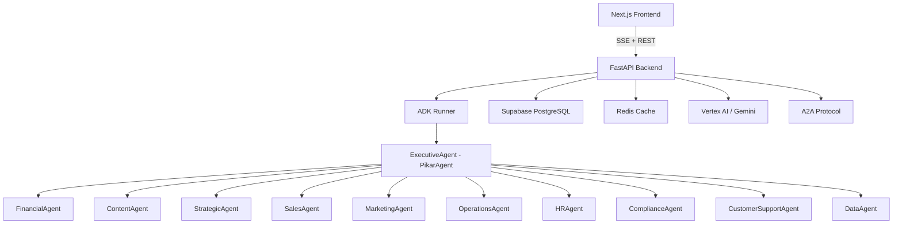

# Pikar AI — Comprehensive Codebase Audit Report

**Date:** 2026-02-15  
**Auditor:** Automated Architecture Review  
**Scope:** Full codebase analysis across all dimensions

---

## Table of Contents

1. [Executive Summary](#1-executive-summary)
2. [Architecture & Structure](#2-architecture--structure)
3. [Code Quality & Standards](#3-code-quality--standards)
4. [Logic & Correctness](#4-logic--correctness)
5. [Performance](#5-performance)
6. [Security](#6-security)
7. [Error Handling & Resilience](#7-error-handling--resilience)
8. [Maintainability & Technical Debt](#8-maintainability--technical-debt)
9. [Testing](#9-testing)
10. [Dependencies](#10-dependencies)
11. [Prioritized Remediation Summary](#11-prioritized-remediation-summary)

---

## 1. Executive Summary

Pikar AI is a multi-agent executive system built on Google ADK with A2A Protocol, featuring a FastAPI backend, Next.js frontend, Supabase persistence, and Redis caching. The codebase demonstrates ambitious scope with 10 specialized agents, 30+ services, and extensive tool integrations.

**Critical findings requiring immediate action:**
- **CRITICAL: Secrets committed to version control** — API keys, service role keys, and OAuth client secrets are hardcoded in `.env` and `app/.env` files that are tracked by git
- **HIGH: Massive Supabase client proliferation** — 15+ independent `create_client()` calls creating separate connection pools
- **HIGH: Inconsistent agent base class usage** — Only the executive agent uses `PikarAgent`; all 11 specialized agents use raw `Agent`
- **MEDIUM: Duplicate migration numbers** — Migrations 0027, 0028, 0029 each have two files with different names

---

## 2. Architecture & Structure

### 2.1 Overall Architecture

### 2.2 Entry Points

| Entry Point | File | Purpose |
|---|---|---|
| FastAPI Server | [`fast_api_app.py`](app/fast_api_app.py) | Main HTTP server, SSE streaming, health checks |
| ADK App | [`agent.py`](app/agent.py) | Agent definitions, tool registry, ADK App wrapper |
| Module Init | [`__init__.py`](app/__init__.py) | Exposes `root_agent` for ADK Web UI |
| ADK Playground | [`agent.py`](agent.py) (root) | Thin wrapper for `adk web` command |

### 2.3 Module Organization

The project follows a domain-driven structure under `app/`:

- **`agents/`** — 10 specialized agent modules + base class + tools (~50 files)
- **`services/`** — 29 service modules covering cache, media, analytics, etc.
- **`persistence/`** — Supabase session service + task store
- **`routers/`** — 12 FastAPI router modules
- **`rag/`** — Knowledge vault, embedding, ingestion, search
- **`mcp/`** — MCP tool integrations (Stripe, Canva, web search/scrape)
- **`middleware/`** — Rate limiter only
- **`orchestration/`** — Knowledge injection tools
- **`commerce/`** — Invoice and inventory services

### 2.4 Findings

| ID | Severity | Finding | Location |
|---|---|---|---|
| ARCH-1 | Medium | Monolithic `fast_api_app.py` at 913 lines handles SSE streaming, health checks, admin endpoints, CORS, middleware, and widget extraction all in one file | [`fast_api_app.py`](app/fast_api_app.py:1) |
| ARCH-2 | Medium | Duplicate variable declarations: `_app_dir` and `_project_root` defined twice | [`fast_api_app.py`](app/fast_api_app.py:21) and [`fast_api_app.py`](app/fast_api_app.py:46) |
| ARCH-3 | Low | Duplicate comments throughout `agent.py` — every import section comment is written twice | [`agent.py`](app/agent.py:35-53) |
| ARCH-4 | Medium | `app/agents/financial/agent.py` and all specialized agents import `Agent` from `google.adk.agents` directly instead of using `PikarAgent` from `base_agent.py`, defeating the purpose of the custom wrapper | [`financial/agent.py`](app/agents/financial/agent.py:17), all 11 agent modules |
| ARCH-5 | Low | Dead code: `example_feature.py` contains an empty class | [`example_feature.py`](app/example_feature.py:1) |
| ARCH-6 | Low | Debug/verification scripts in project root: `verify_auth.py`, `verify_veo.py`, `verify_pro_video.py`, `list_models.py`, `check_buckets.py`, `test_simple.py` | Root directory |

**Recommendation for ARCH-4:** All specialized agents should use `from app.agents.base_agent import PikarAgent as Agent` to maintain consistent path resolution behavior.

---

## 3. Code Quality & Standards

### 3.1 Naming Conventions

Generally consistent Python naming with `snake_case` for functions/variables and `PascalCase` for classes. The project uses ruff for linting with a reasonable configuration in [`pyproject.toml`](pyproject.toml:61).

### 3.2 Findings

| ID | Severity | Finding | Location |
|---|---|---|---|
| QUAL-1 | Low | `ruff: noqa` blanket suppression at top of `agent.py` disables all linting for the entire file | [`agent.py`](app/agent.py:1) |
| QUAL-2 | Low | `pyproject.toml` has placeholder author info: `Your Name` / `your@email.com` | [`pyproject.toml`](pyproject.toml:5) |
| QUAL-3 | Medium | Inconsistent env var naming: `SUPABASE_SERVICE_ROLE_KEY` in some places, `SUPABASE_SERVICE_KEY` in AGENTS.md | [`AGENTS.md`](AGENTS.md) vs [`app/.env`](app/.env:10) |
| QUAL-4 | Low | Type checker `ty` configured to ignore most useful rules: `unresolved-import`, `unresolved-attribute`, `invalid-argument-type`, `invalid-assignment`, `invalid-return-type` all set to `ignore` | [`pyproject.toml`](pyproject.toml:92-97) |
| QUAL-5 | Medium | `fast_api_app.py` has inline imports scattered throughout the file rather than at the top | [`fast_api_app.py`](app/fast_api_app.py:212-216), [`fast_api_app.py`](app/fast_api_app.py:265), [`fast_api_app.py`](app/fast_api_app.py:313-325) |
| QUAL-6 | Low | `get_revenue_stats()` in `agent.py` returns hardcoded mock data with no TODO or flag indicating it needs real implementation | [`agent.py`](app/agent.py:92-104) |
| QUAL-7 | Low | `update_initiative_status()` only logs and returns success without persisting anything | [`agent.py`](app/agent.py:127-138) |

### 3.3 Documentation

- Good: AGENTS.md provides comprehensive project overview
- Good: Most tool functions have detailed docstrings with Args/Returns
- Good: Executive instruction prompt is thorough and well-structured
- Missing: No API documentation beyond FastAPI auto-docs
- Missing: No architecture decision records (ADRs)

---

## 4. Logic & Correctness

### 4.1 Findings

| ID | Severity | Finding | Location |
|---|---|---|---|
| LOGIC-1 | High | Duplicate migration numbers will cause conflicts: `0027_fix_advisors.sql` and `0027_fix_critical_security.sql`; `0028_fix_advisor_issues.sql` and `0028_fix_advisors_part_2.sql`; `0029_consolidate_landing_pages_policies.sql` and `0029_fix_advisors_part_3.sql` | [`supabase/migrations/`](supabase/migrations/) |
| LOGIC-2 | Medium | Rate limiter calls `get_supabase_client()` and `supabase.auth.get_user(token)` on EVERY request to determine persona-based limits — this is a synchronous blocking call in the request path | [`rate_limiter.py`](app/middleware/rate_limiter.py:32-38) |
| LOGIC-3 | Medium | Rate limiter calls `get_supabase_client()` twice per request — once for auth, once for persona lookup | [`rate_limiter.py`](app/middleware/rate_limiter.py:33) and [`rate_limiter.py`](app/middleware/rate_limiter.py:49) |
| LOGIC-4 | Medium | `_is_model_unavailable_error` uses string matching on error messages which is fragile: `"MODEL" in msg and "UNAVAILABLE" in msg` could match unrelated errors | [`fast_api_app.py`](app/fast_api_app.py:551-560) |
| LOGIC-5 | Low | `SupabaseTaskStore.save()` passes `"now()"` as a string for `updated_at` — this is a SQL function that won't work via the Supabase REST API; it will be stored as the literal string `"now()"` | [`supabase_task_store.py`](app/persistence/supabase_task_store.py:43) |
| LOGIC-6 | Medium | Fallback executive agent is built without sub_agents, meaning if the primary model fails, the fallback agent loses ALL delegation capabilities | [`agent.py`](app/agent.py:413) |
| LOGIC-7 | Low | `_extract_widget_from_event` regex for JSON extraction is fragile and won't handle nested objects properly | [`fast_api_app.py`](app/fast_api_app.py:696) |

---

## 5. Performance

### 5.1 Findings

| ID | Severity | Finding | Location |
|---|---|---|---|
| PERF-1 | High | **15+ independent Supabase client instances** created across the codebase via `create_client()` — each creates its own HTTP connection pool. Found in: `auth.py`, `onboarding.py`, `vault.py`, `media.py`, `docs.py`, `forms.py`, `google_sheets.py`, `canva_media.py`, `landing_page.py`, `form_handler.py`, `stitch.py`, `invoice_service.py`, `inventory_service.py`, `base_service.py`, `orchestration/tools.py` | Multiple files |
| PERF-2 | Medium | `auth.py:get_supabase_client()` creates a NEW Supabase client on every call — no caching or singleton | [`auth.py`](app/app_utils/auth.py:20-29) |
| PERF-3 | Medium | Rate limiter makes 2 Supabase API calls per request (auth + persona query) without caching | [`rate_limiter.py`](app/middleware/rate_limiter.py:17-65) |
| PERF-4 | Medium | `SupabaseSessionService.get_session()` always fetches events from DB even when session metadata is cached — events are never cached | [`supabase_session_service.py`](app/persistence/supabase_session_service.py:236-244) |
| PERF-5 | Low | `_compact_event_for_context` does `copy.deepcopy` on every event during session load, which is expensive for large event payloads | [`supabase_session_service.py`](app/persistence/supabase_session_service.py:47) |
| PERF-6 | Low | SSE event generator creates and cancels asyncio tasks in a tight loop with 0.5s timeout for multiplexing ADK events and progress events | [`fast_api_app.py`](app/fast_api_app.py:877-894) |

**Recommendation for PERF-1:** Consolidate all Supabase client usage to go through `app.services.supabase_client.SupabaseService` singleton. Remove all direct `create_client()` calls.

---

## 6. Security

### 6.1 Findings

| ID | Severity | Finding | Location |
|---|---|---|---|
| SEC-1 | **CRITICAL** | **Real API keys and secrets committed to version control.** Root `.env` contains: Supabase service role key, YouTube/LinkedIn/Facebook/TikTok OAuth client secrets, Firecrawl API key, scheduler secret. `app/.env` contains: Tavily API key, Firecrawl API key, Supabase service role key. `frontend/.env.local` contains: Google Stitch access token. | [`.env`](.env:1-45), [`app/.env`](app/.env:1-36), [`frontend/.env.local`](frontend/.env.local:1-10) |
| SEC-2 | **CRITICAL** | `.gitignore` only ignores root `.env` — `app/.env` is NOT in `.gitignore` and is likely committed to git | [`.gitignore`](.gitignore:111) — pattern `.env` only matches root |
| SEC-3 | High | `frontend/.env.local` contains `Google_Stitch_Access_Token` which appears to be a Google OAuth access token — these should never be in env files | [`frontend/.env.local`](frontend/.env.local:10) |
| SEC-4 | High | `ALLOW_ANONYMOUS_CHAT` env flag allows unauthenticated access to the SSE chat endpoint when set to `"1"` | [`fast_api_app.py`](app/fast_api_app.py:756) |
| SEC-5 | High | `ALLOW_ANY_AUTH_ADMIN_ENDPOINT` env flag bypasses all admin authorization checks | [`fast_api_app.py`](app/fast_api_app.py:478) |
| SEC-6 | Medium | `verify_token` in `auth.py` continues even if JWT signature verification fails — it only logs a warning | [`auth.py`](app/app_utils/auth.py:83-84) |
| SEC-7 | Medium | `onboarding.py` defines its own `get_supabase_client()` using `SUPABASE_SERVICE_ROLE_KEY` directly, bypassing the centralized client | [`onboarding.py`](app/routers/onboarding.py:31-36) |
| SEC-8 | Medium | `vault.py` router creates its own Supabase client using `SUPABASE_SERVICE_ROLE_KEY` | [`vault.py`](app/routers/vault.py:31-33) |
| SEC-9 | Low | CORS allows all methods and all headers: `allow_methods=["*"], allow_headers=["*"]` | [`fast_api_app.py`](app/fast_api_app.py:308-309) |

**IMMEDIATE ACTION REQUIRED for SEC-1/SEC-2:**
1. Rotate ALL exposed secrets immediately
2. Add `app/.env`, `frontend/.env.local`, and `**/.env*` to `.gitignore`
3. Remove secrets from git history using `git filter-branch` or BFG Repo-Cleaner
4. Use `.env.example` files with placeholder values instead

---

## 7. Error Handling & Resilience

### 7.1 Findings

| ID | Severity | Finding | Location |
|---|---|---|---|
| ERR-1 | Medium | `SupabaseSessionService._execute_with_retry` catches `httpx.ConnectError` but re-raises all other exceptions immediately — no handling for 5xx server errors from Supabase | [`supabase_session_service.py`](app/persistence/supabase_session_service.py:129-132) |
| ERR-2 | Medium | `search_business_knowledge` silently swallows all exceptions and returns empty results | [`agent.py`](app/agent.py:122-124) |
| ERR-3 | Medium | Session creation failure in SSE endpoint is caught and logged but execution continues — the runner may fail with an unclear error | [`fast_api_app.py`](app/fast_api_app.py:813-815) |
| ERR-4 | Low | `rate_limiter.py:get_supabase_client()` returns `None` on failure but callers check for `None` — however the function signature says it returns `Client` | [`rate_limiter.py`](app/middleware/rate_limiter.py:10-15) |
| ERR-5 | Medium | `SupabaseTaskStore` methods catch exceptions and re-raise them — the `save()` and `delete()` methods log then `raise e` which loses the original traceback in Python 3 | [`supabase_task_store.py`](app/persistence/supabase_task_store.py:47-48) |
| ERR-6 | Low | Redis cache service silently returns `None` on all failures — callers must always handle cache misses, which they do, but there is no alerting on persistent cache failures | [`cache.py`](app/services/cache.py:75-80) |

### 7.2 Resilience Patterns Present

- **Good:** Retry with exponential backoff in `SupabaseSessionService._execute_with_retry`
- **Good:** Fallback model when primary Gemini model is unavailable
- **Good:** Graceful degradation from Supabase sessions to InMemory sessions
- **Good:** Redis cache failures don't crash the application
- **Good:** A2A initialization failure is non-fatal

---

## 8. Maintainability & Technical Debt

### 8.1 Findings

| ID | Severity | Finding | Location |
|---|---|---|---|
| DEBT-1 | High | **Supabase client proliferation** — At least 7 different `get_supabase_client()` functions defined across the codebase, each creating independent clients | `auth.py`, `onboarding.py`, `rate_limiter.py`, `orchestration/tools.py`, `media.py`, `supabase_client.py`, `knowledge_vault.py` |
| DEBT-2 | Medium | Deprecated module `app/services/supabase.py` still actively imported by `rate_limiter.py` and `fast_api_app.py` | [`supabase.py`](app/services/supabase.py:10-14) |
| DEBT-3 | Medium | `fast_api_app.py` is 913 lines with mixed concerns — SSE streaming, widget extraction, health checks, admin endpoints, CORS config, middleware setup | [`fast_api_app.py`](app/fast_api_app.py) |
| DEBT-4 | Medium | `EXECUTIVE_INSTRUCTION` prompt is ~200 lines of text embedded directly in Python code — should be externalized to a template file | [`agent.py`](app/agent.py:171-369) |
| DEBT-5 | Low | `app/agents/tools/` contains 30+ tool files with significant overlap in patterns — no shared base class or decorator for common tool patterns like user_id extraction | [`app/agents/tools/`](app/agents/tools/) |
| DEBT-6 | Low | `antigravity-awesome-skills/` directory contains ~2MB of third-party skill content that appears vendored rather than managed as a dependency | [`antigravity-awesome-skills/`](antigravity-awesome-skills/) |
| DEBT-7 | Low | Multiple `nul` file in root directory — appears to be an accidental Windows artifact | [`nul`](nul) |
| DEBT-8 | Low | `app/services/report_scheduler.py` imports from `app.persistence.supabase_client` which doesn't exist — likely should be `app.services.supabase_client` | [`report_scheduler.py`](app/services/report_scheduler.py:82) |

---

## 9. Testing

### 9.1 Coverage Assessment

| Test Category | Count | Coverage |
|---|---|---|
| Unit tests | 23 files in `tests/unit/` | Moderate — covers services, tools, schemas |
| Integration tests | 14 files in `tests/integration/` | Good breadth — A2A, agents, workflows, RAG |
| App-level tests | 6 files in `app/tests/` | SSE, widget extraction, admin endpoints |
| Eval datasets | 11 `.evalset.json` files | One per agent type |
| Load tests | 1 file | Basic Locust setup |
| Frontend tests | `frontend/__tests__/` directory exists | Unknown coverage |

### 9.2 Findings

| ID | Severity | Finding | Location |
|---|---|---|---|
| TEST-1 | High | **No test for the main SSE chat endpoint** (`/a2a/app/run_sse`) — the most critical user-facing endpoint | [`fast_api_app.py`](app/fast_api_app.py:746) |
| TEST-2 | Medium | `test_example_feature.py` tests the empty `ExampleFeature` class — dead test | [`test_example_feature.py`](tests/unit/test_example_feature.py) |
| TEST-3 | Medium | Tests are split between `app/tests/` and `tests/` — inconsistent location | Both directories |
| TEST-4 | Medium | No tests for authentication flows (`verify_token`, `get_user_id_from_bearer_token`) | [`auth.py`](app/app_utils/auth.py) |
| TEST-5 | Medium | No tests for rate limiter persona-based limiting | [`rate_limiter.py`](app/middleware/rate_limiter.py) |
| TEST-6 | Low | `conftest.py` only exists in `tests/unit/` — no shared fixtures for integration tests | [`tests/unit/conftest.py`](tests/unit/conftest.py) |

---

## 10. Dependencies

### 10.1 Python Dependencies

| Dependency | Version | Notes |
|---|---|---|
| `google-adk` | `>=1.16.0,<2.0.0` | Core framework — pinned to major version |
| `a2a-sdk` | `~=0.3.9` | Tightly pinned — may need updates |
| `fastapi` | `~=0.115.8` | Tightly pinned |
| `supabase` | `>=2.27.2` | Open upper bound — risky for breaking changes |
| `psycopg2-binary` | `>=2.9.11` | Binary package — not recommended for production Docker |
| `alembic` + `sqlalchemy` | In both main and dev deps | Duplicated in `[dependency-groups] dev` and `[project] dependencies` |
| `stripe` | Not in `pyproject.toml` | Used in `stripe_payments.py` but not declared as dependency |

### 10.2 Frontend Dependencies

| Dependency | Version | Notes |
|---|---|---|
| `next` | `16.1.4` | Very recent |
| `react` | `19.2.3` | React 19 — cutting edge |
| `@remotion/player` + `remotion` | `^4.0.421` | Video rendering |
| `reactflow` | `^11.11.4` | Workflow visualization |

### 10.3 Findings

| ID | Severity | Finding | Location |
|---|---|---|---|
| DEP-1 | Medium | `stripe` SDK is imported in `stripe_payments.py` but not declared in `pyproject.toml` dependencies | [`stripe_payments.py`](app/mcp/tools/stripe_payments.py:32) |
| DEP-2 | Low | `psycopg2-binary` should be `psycopg2` in production — binary wheels can have issues in some container environments | [`pyproject.toml`](pyproject.toml:36) |
| DEP-3 | Low | `alembic` and `sqlalchemy` appear in both main dependencies and dev dependencies | [`pyproject.toml`](pyproject.toml:31-32) and [`pyproject.toml`](pyproject.toml:47-48) |
| DEP-4 | Low | `supabase>=2.27.2` has no upper bound — a major version bump could break the application | [`pyproject.toml`](pyproject.toml:20) |

---

## 11. Prioritized Remediation Summary

### CRITICAL — Immediate Action Required

| # | Finding | Risk | Effort |
|---|---|---|---|
| 1 | **SEC-1/SEC-2: Secrets in version control** — Rotate ALL exposed API keys, OAuth secrets, and service role keys. Add proper `.gitignore` patterns. Scrub git history. | Data breach, unauthorized access to all integrated services | Medium |

### HIGH — Address Within 1 Sprint

| # | Finding | Risk | Effort |
|---|---|---|---|
| 2 | **PERF-1/DEBT-1: Supabase client proliferation** — Consolidate 15+ independent `create_client()` calls to use the singleton `SupabaseService` | Connection pool exhaustion, resource waste | Medium |
| 3 | **ARCH-4: Inconsistent PikarAgent usage** — All 11 specialized agents bypass the custom `PikarAgent` wrapper | ADK path resolution issues in sub-agents | Low |
| 4 | **LOGIC-1: Duplicate migration numbers** — Resolve conflicting migration files 0027, 0028, 0029 | Database migration failures | Low |
| 5 | **TEST-1: No SSE endpoint tests** — Add integration tests for the primary chat endpoint | Regressions in core functionality | Medium |

### MEDIUM — Address Within 2 Sprints

| # | Finding | Risk | Effort |
|---|---|---|---|
| 6 | **PERF-3/LOGIC-2: Rate limiter DB calls** — Cache persona lookups in Redis | Latency on every request | Low |
| 7 | **DEBT-3: Monolithic fast_api_app.py** — Extract SSE streaming, widget extraction, and health checks into separate modules | Maintainability | Medium |
| 8 | **SEC-6: JWT verification continues on failure** — Decide whether JWT signature verification should be mandatory | Auth bypass potential | Low |
| 9 | **LOGIC-5: Task store updated_at** — Use `datetime.utcnow().isoformat()` instead of `"now()"` string | Incorrect timestamps | Low |
| 10 | **LOGIC-6: Fallback agent has no sub-agents** — Consider sharing sub-agents or building a limited fallback set | Degraded functionality on model failover | Medium |

### LOW — Backlog

| # | Finding | Risk | Effort |
|---|---|---|---|
| 11 | Clean up dead code: `example_feature.py`, debug scripts, `nul` file | Code hygiene | Low |
| 12 | Externalize `EXECUTIVE_INSTRUCTION` to template file | Maintainability | Low |
| 13 | Add `conftest.py` for integration tests, consolidate test locations | Test maintainability | Low |
| 14 | Add `stripe` to `pyproject.toml` dependencies | Build reliability | Low |
| 15 | Update `pyproject.toml` author info | Professionalism | Low |
