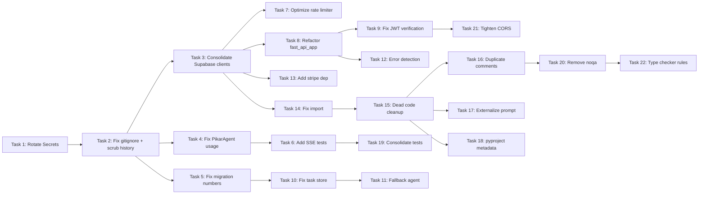

# Pikar AI — Codebase Remediation Task List

**Reference:** [`plans/codebase-audit-report.md`](codebase-audit-report.md)  
**Created:** 2026-02-15  
**Priority Tiers:** P0 = Critical/Immediate, P1 = High/This Sprint, P2 = Medium/Next Sprint, P3 = Low/Backlog

---

## P0 — CRITICAL: Secrets & Credential Exposure

### Task 1: Rotate all exposed secrets
**Findings:** SEC-1, SEC-2, SEC-3  
**Files:** [`.env`](../.env), [`app/.env`](../app/.env), [`frontend/.env.local`](../frontend/.env.local)

- [ ] 1.1 Rotate Supabase service role key and anon key in Supabase Dashboard
- [ ] 1.2 Rotate Tavily API key (check `.env` for current value)
- [ ] 1.3 Rotate Firecrawl API key (check `.env` for current value)
- [ ] 1.4 Rotate YouTube OAuth client secret (check `.env` for current value)
- [ ] 1.5 Rotate LinkedIn client secret (check `.env` for current value)
- [ ] 1.6 Rotate Facebook client secret (check `.env` for current value)
- [ ] 1.7 Rotate TikTok client secret (check `.env` for current value)
- [ ] 1.8 Rotate Cloud Scheduler secret (check `.env` for current value)
- [ ] 1.9 Revoke Google Stitch access token in [`frontend/.env.local`](../frontend/.env.local:10)
- [ ] 1.10 Rotate Google Cloud service account key (regenerate in GCP Console)

### Task 2: Fix .gitignore and scrub git history
**Findings:** SEC-1, SEC-2

- [ ] 2.1 Add `app/.env` to [`.gitignore`](../.gitignore)
- [ ] 2.2 Add `frontend/.env.local` to [`.gitignore`](../.gitignore)
- [ ] 2.3 Add catch-all pattern `**/.env*` to [`.gitignore`](../.gitignore) (excluding `.env.example` files)
- [ ] 2.4 Create `app/.env.example` with placeholder values for all required env vars
- [ ] 2.5 Create `.env.example` at project root with placeholder values
- [ ] 2.6 Create `frontend/.env.local.example` with placeholder values
- [ ] 2.7 Use BFG Repo-Cleaner or `git filter-repo` to remove secrets from git history
- [ ] 2.8 Force-push cleaned history and notify all contributors to re-clone

---

## P1 — HIGH: Architecture & Correctness

### Task 3: Consolidate Supabase client instances
**Findings:** PERF-1, DEBT-1, PERF-2

- [ ] 3.1 Refactor [`app/app_utils/auth.py`](../app/app_utils/auth.py:20-29) to use `SupabaseService` singleton instead of creating new clients per call
- [ ] 3.2 Refactor [`app/routers/onboarding.py`](../app/routers/onboarding.py:31-36) to use centralized client
- [ ] 3.3 Refactor [`app/routers/vault.py`](../app/routers/vault.py:31-33) to use centralized client
- [ ] 3.4 Refactor [`app/agents/tools/media.py`](../app/agents/tools/media.py:63-69) `_get_supabase_client()` to use centralized client
- [ ] 3.5 Refactor [`app/agents/tools/docs.py`](../app/agents/tools/docs.py:48-58) to use centralized client
- [ ] 3.6 Refactor [`app/agents/tools/forms.py`](../app/agents/tools/forms.py:29-39) to use centralized client
- [ ] 3.7 Refactor [`app/agents/tools/google_sheets.py`](../app/agents/tools/google_sheets.py:29-39) to use centralized client
- [ ] 3.8 Refactor [`app/mcp/tools/canva_media.py`](../app/mcp/tools/canva_media.py:61-66) to use centralized client
- [ ] 3.9 Refactor [`app/mcp/tools/landing_page.py`](../app/mcp/tools/landing_page.py:33-35) to use centralized client
- [ ] 3.10 Refactor [`app/mcp/tools/form_handler.py`](../app/mcp/tools/form_handler.py:29-31) to use centralized client
- [ ] 3.11 Refactor [`app/mcp/tools/stitch.py`](../app/mcp/tools/stitch.py:86-87) to use centralized client
- [ ] 3.12 Refactor [`app/commerce/invoice_service.py`](../app/commerce/invoice_service.py:37-38) to use centralized client
- [ ] 3.13 Refactor [`app/commerce/inventory_service.py`](../app/commerce/inventory_service.py:24-25) to use centralized client
- [ ] 3.14 Refactor [`app/orchestration/tools.py`](../app/orchestration/tools.py:28) to use centralized client
- [ ] 3.15 Refactor [`app/middleware/rate_limiter.py`](../app/middleware/rate_limiter.py:10-12) to use centralized client
- [ ] 3.16 Remove deprecated [`app/services/supabase.py`](../app/services/supabase.py) after all imports are migrated

### Task 4: Fix specialized agents to use PikarAgent
**Finding:** ARCH-4

- [ ] 4.1 Update [`app/agents/financial/agent.py`](../app/agents/financial/agent.py:17) — change `from google.adk.agents import Agent` to `from app.agents.base_agent import PikarAgent as Agent`
- [ ] 4.2 Update [`app/agents/content/agent.py`](../app/agents/content/agent.py:17)
- [ ] 4.3 Update [`app/agents/strategic/agent.py`](../app/agents/strategic/agent.py:6)
- [ ] 4.4 Update [`app/agents/sales/agent.py`](../app/agents/sales/agent.py:6)
- [ ] 4.5 Update [`app/agents/marketing/agent.py`](../app/agents/marketing/agent.py:6)
- [ ] 4.6 Update [`app/agents/operations/agent.py`](../app/agents/operations/agent.py:9)
- [ ] 4.7 Update [`app/agents/hr/agent.py`](../app/agents/hr/agent.py:6)
- [ ] 4.8 Update [`app/agents/compliance/agent.py`](../app/agents/compliance/agent.py:6)
- [ ] 4.9 Update [`app/agents/customer_support/agent.py`](../app/agents/customer_support/agent.py:6)
- [ ] 4.10 Update [`app/agents/data/agent.py`](../app/agents/data/agent.py:6)
- [ ] 4.11 Update [`app/agents/reporting/agent.py`](../app/agents/reporting/agent.py:14)
- [ ] 4.12 Verify all agents work correctly after the change with existing tests

### Task 5: Fix duplicate migration numbers
**Finding:** LOGIC-1

- [ ] 5.1 Rename `0027_fix_critical_security.sql` to `0050_fix_critical_security.sql` (or next available number)
- [ ] 5.2 Rename `0028_fix_advisors_part_2.sql` to `0051_fix_advisors_part_2.sql`
- [ ] 5.3 Rename `0029_fix_advisors_part_3.sql` to `0052_fix_advisors_part_3.sql`
- [ ] 5.4 Verify migration order dependencies are preserved after renumbering
- [ ] 5.5 Test migration sequence on a fresh database

### Task 6: Add SSE endpoint tests
**Finding:** TEST-1

- [ ] 6.1 Create `tests/integration/test_sse_chat.py` with tests for `/a2a/app/run_sse`
- [ ] 6.2 Test authenticated request flow
- [ ] 6.3 Test anonymous chat when `ALLOW_ANONYMOUS_CHAT=1`
- [ ] 6.4 Test rejection when unauthenticated and anonymous chat disabled
- [ ] 6.5 Test widget extraction from SSE events
- [ ] 6.6 Test fallback model activation on primary model failure

---

## P2 — MEDIUM: Performance & Code Quality

### Task 7: Optimize rate limiter
**Findings:** LOGIC-2, LOGIC-3, PERF-3

- [ ] 7.1 Cache persona lookups in Redis with TTL matching `TTL_USER_CONFIG` (1 hour)
- [ ] 7.2 Eliminate duplicate `get_supabase_client()` calls — reuse client between auth and persona lookup
- [ ] 7.3 Consider using `verify_token_fast()` for rate limiter auth instead of full Supabase call
- [ ] 7.4 Add tests for rate limiter persona-based limiting

### Task 8: Refactor fast_api_app.py
**Finding:** DEBT-3, ARCH-1, ARCH-2

- [ ] 8.1 Extract widget extraction logic (`_extract_widget_from_event`, `_inject_synthetic_text_*`) into `app/services/widget_extraction.py`
- [ ] 8.2 Extract SSE streaming logic (`event_generator`, `run_sse`) into `app/routers/chat.py`
- [ ] 8.3 Extract health check endpoints into `app/routers/health.py`
- [ ] 8.4 Extract admin endpoints into `app/routers/admin.py`
- [ ] 8.5 Remove duplicate `_app_dir` / `_project_root` declarations at lines 21 and 46
- [ ] 8.6 Move inline imports to top of file where possible

### Task 9: Fix JWT verification behavior
**Finding:** SEC-6

- [ ] 9.1 Decide on policy: should JWT signature verification failure block the request?
- [ ] 9.2 If yes, change [`auth.py`](../app/app_utils/auth.py:83-84) to raise `HTTPException(401)` on JWT signature failure
- [ ] 9.3 If no, document the rationale clearly in code comments
- [ ] 9.4 Add tests for both JWT verification paths

### Task 10: Fix SupabaseTaskStore timestamp
**Finding:** LOGIC-5

- [ ] 10.1 Replace `"now()"` string with `datetime.utcnow().isoformat()` in [`supabase_task_store.py`](../app/persistence/supabase_task_store.py:43)
- [ ] 10.2 Fix `raise e` to `raise` (bare raise) to preserve traceback in [`supabase_task_store.py`](../app/persistence/supabase_task_store.py:47-48)

### Task 11: Improve fallback agent capabilities
**Finding:** LOGIC-6

- [ ] 11.1 Investigate whether ADK supports sharing sub_agents between two root agents
- [ ] 11.2 If not, create lightweight fallback sub-agents (tools-only, no sub-agents of their own)
- [ ] 11.3 Document the fallback behavior and its limitations

### Task 12: Fix model error detection
**Finding:** LOGIC-4

- [ ] 12.1 Replace string-matching in `_is_model_unavailable_error` with proper exception type checking
- [ ] 12.2 Check if ADK provides specific exception classes for 404/429 errors
- [ ] 12.3 Add unit tests for error detection logic

### Task 13: Add missing dependency
**Finding:** DEP-1

- [ ] 13.1 Add `stripe>=7.0.0` to `[project] dependencies` in [`pyproject.toml`](../pyproject.toml)
- [ ] 13.2 Run `uv sync` to update lock file

### Task 14: Fix report_scheduler import
**Finding:** DEBT-8

- [ ] 14.1 Change `from app.persistence.supabase_client import get_supabase_client` to `from app.services.supabase_client import get_supabase_client` in [`report_scheduler.py`](../app/services/report_scheduler.py:82)

---

## P3 — LOW: Code Hygiene & Polish

### Task 15: Remove dead code and artifacts
**Findings:** ARCH-5, ARCH-6, DEBT-7

- [ ] 15.1 Delete [`app/example_feature.py`](../app/example_feature.py)
- [ ] 15.2 Delete [`tests/unit/test_example_feature.py`](../tests/unit/test_example_feature.py)
- [ ] 15.3 Delete [`nul`](../nul) (Windows artifact)
- [ ] 15.4 Move debug/verification scripts to a `scripts/debug/` directory or delete: `verify_auth.py`, `verify_veo.py`, `verify_pro_video.py`, `list_models.py`, `check_buckets.py`, `test_simple.py`

### Task 16: Clean up duplicate comments
**Finding:** ARCH-3

- [ ] 16.1 Remove duplicate comments in [`agent.py`](../app/agent.py:35-53) (every import section comment is written twice)

### Task 17: Externalize executive instruction
**Finding:** DEBT-4

- [ ] 17.1 Move `EXECUTIVE_INSTRUCTION` from [`agent.py`](../app/agent.py:171-369) to `app/agents/prompts/executive.txt` or similar
- [ ] 17.2 Load the instruction at module level using `Path.read_text()`

### Task 18: Fix pyproject.toml metadata
**Findings:** QUAL-2, DEP-3

- [ ] 18.1 Update author name and email in [`pyproject.toml`](../pyproject.toml:5)
- [ ] 18.2 Remove duplicate `alembic` and `sqlalchemy` from main dependencies (keep only in dev)
- [ ] 18.3 Add upper bound to `supabase` dependency: `supabase>=2.27.2,<3.0.0`

### Task 19: Consolidate test locations
**Findings:** TEST-3, TEST-6

- [ ] 19.1 Move tests from `app/tests/` to `tests/unit/` or `tests/integration/` as appropriate
- [ ] 19.2 Create `tests/integration/conftest.py` with shared fixtures
- [ ] 19.3 Update `pytest.ini_options` if needed

### Task 20: Remove ruff noqa blanket suppression
**Finding:** QUAL-1

- [ ] 20.1 Remove `# ruff: noqa` from [`agent.py`](../app/agent.py:1)
- [ ] 20.2 Fix any linting issues that surface
- [ ] 20.3 Add targeted `# noqa` comments only where genuinely needed

### Task 21: Tighten CORS configuration
**Finding:** SEC-9

- [ ] 21.1 Replace `allow_methods=["*"]` with explicit list: `["GET", "POST", "PUT", "DELETE", "OPTIONS"]`
- [ ] 21.2 Replace `allow_headers=["*"]` with explicit list: `["Authorization", "Content-Type", "Accept"]`

### Task 22: Enable useful type checker rules
**Finding:** QUAL-4

- [ ] 22.1 Gradually re-enable `ty` rules one at a time in [`pyproject.toml`](../pyproject.toml:92-97)
- [ ] 22.2 Start with `invalid-return-type` and `invalid-assignment`
- [ ] 22.3 Fix type errors that surface

---

## Execution Order Recommendation

Tasks 1 and 2 are **blocking** — they must be completed before any other work is merged to avoid re-exposing rotated secrets.
